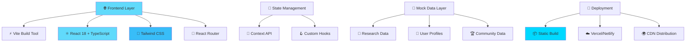

# MOBOX De-Sci Infrastructure

```
███╗   ███╗ ██████╗ ██████╗  ██████╗ ██╗  ██╗    ████████╗██╗  ██╗███████╗    ██████╗  ██████╗ ██╗  ██╗
████╗ ████║██╔═══██╗██╔══██╗██╔═══██╗╚██╗██╔╝    ╚══██╔══╝██║  ██║██╔════╝    ██╔══██╗██╔═══██╗╚██╗██╔╝
██╔████╔██║██║   ██║██████╔╝██║   ██║ ╚███╔╝        ██║   ███████║█████╗      ██████╔╝██║   ██║ ╚███╔╝ 
██║╚██╔╝██║██║   ██║██╔══██╗██║   ██║ ██╔██╗        ██║   ██╔══██║██╔══╝      ██╔══██╗██║   ██║ ██╔██╗ 
██║ ╚═╝ ██║╚██████╔╝██████╔╝╚██████╔╝██╔╝ ██╗       ██║   ██║  ██║███████╗    ██████╔╝╚██████╔╝██╔╝ ██╗
╚═╝     ╚═╝ ╚═════╝ ╚═════╝  ╚═════╝ ╚═╝  ╚═╝       ╚═╝   ╚═╝  ╚═╝╚══════╝    ╚═════╝  ╚═════╝ ╚═╝  ╚═╝
                                                                                                           
🧬 Decentralized Science • 🎮 Gamified Research • 🏆 Web3 Innovation
```

<div align="center">

[](https://opensource.org/licenses/MIT)
[]()
[]()
[](https://reactjs.org/)
[](https://www.typescriptlang.org/)
[](https://vitejs.dev/)

**🚀 [Live Demo](https://mobox-desci.vercel.app) • 📚 [Documentation](https://docs.mobox.io) • 💬 [Community](https://discord.gg/mobox) • 🐛 [Issues](https://github.com/mobox/mobox-desci-infra/issues)**

</div>

---

## 🔬 About THE BOX

> **🌟 MOBOX's Revolutionary Evolution: From Web3 Gaming to Decentralized Science**

MOBOX presents **THE BOX** - a revolutionary gamified decentralized science platform that transforms complex scientific research into interactive, accessible experiences for everyone. Built on our proven Web3 gaming expertise, we're pioneering the future of democratized scientific discovery.

```
┌─────────────────────────────────────────────────────────────────┐
│  🎮 MOBOX Evolution Journey                                     │
│                                                                 │
│  Phase 1: Web3 Gaming     Phase 2: Game Production            │
│  ┌─────────────────┐      ┌─────────────────┐                 │
│  │   🕹️ Gaming      │ ──→  │   🎨 UGC         │                 │
│  │   Platform      │      │   Creation      │                 │
│  │   10+ Titles    │      │   Dragonverse   │                 │
│  └─────────────────┘      └─────────────────┘                 │
│                                    │                          │
│                                    ▼                          │
│                           Phase 3: Decentralized Science      │
│                           ┌─────────────────┐                 │
│                           │   🔬 THE BOX    │                 │
│                           │   Gamified      │                 │
│                           │   De-Sci        │                 │
│                           └─────────────────┘                 │
└─────────────────────────────────────────────────────────────────┘
```

### 🌟 Mission Statement

Making scientific research interactive, accessible, and fun for ALL through gamified biocultivation infrastructure that connects research, product development, and retail through Decentralized Science.

## 🚀 Key Features

### 🧪 Biocultivation Home-Lab
- **Advanced Cultivation Chamber**: Supports plants, fungi, and customized microbiomes
- **Laboratory-Grade Controls**: Precision management of light, nutrients, temperature, and humidity
- **Food-Grade Materials**: Safe, easy-to-clean design with integrated monitoring
- **Digital Twin Visualization**: Real-time experiment tracking and microscopic world exploration

### 🎮 Gamified Research Experience
- **Interactive Scientific Discovery**: Transform complex concepts into intuitive experiences
- **Global Collaboration**: Community-driven research challenges and shared adventures
- **Player-Scientist Hybrid**: Participate as both researcher and gaming enthusiast
- **Progress Tracking**: Achievement systems and research milestone rewards

### 💰 Data Monetization Ecosystem
- **Blockchain-Verified Results**: Traceable, certified, and creator-owned experimental data
- **Revenue Sharing**: Transform scientific contributions into valuable digital assets
- **Commercial Partnerships**: Direct flow to research institutions and industry partners
- **Equitable Research Economy**: Everyone participates and benefits from discoveries

### 🪙 $MBOX Integration
- **Primary Payment System**: Essential for hardware purchases and platform transactions
- **Deflationary Model**: Buyback and burn funded by platform revenue
- **Priority Access**: Special benefits for $MBOX and veMBOX holders
- **Revenue Sharing**: Platform profits distributed to token holders
- **Ecosystem Airdrops**: Partner asset distributions to BOX holders

## 🏗️ Platform Architecture

<div align="center">

```
                          🌐 THE BOX ECOSYSTEM
    ┌─────────────────────────────────────────────────────────────────┐
    │                                                                 │
    │  🎮 Gamified Layer                🔬 Research Layer              │
    │  ┌─────────────────┐              ┌─────────────────┐           │
    │  │ 🏆 Challenges    │              │ 🧪 Experiments  │           │
    │  │ 🎯 Achievements  │ ◄────────────┤ 📊 Data Collection         │
    │  │ 👥 Community     │              │ 📈 Analytics    │           │
    │  │ 💰 Rewards       │              │ 🔄 Collaboration│           │
    │  └─────────────────┘              └─────────────────┘           │
    │           │                                 │                   │
    │           ▼                                 ▼                   │
    │  💎 Blockchain Layer              🔧 Hardware Layer             │
    │  ┌─────────────────┐              ┌─────────────────┐           │
    │  │ 🪙 $MBOX Tokens  │              │ 🏭 BioBox Alpha │           │
    │  │ 🔐 Data Verification            │ 🏭 BioBox Beta  │           │
    │  │ 💱 Marketplace   │ ◄────────────┤ 🌡️  Sensors     │           │
    │  │ 📜 Smart Contracts              │ 📡 IoT Connectivity        │
    │  └─────────────────┘              └─────────────────┘           │
    │                                                                 │
    └─────────────────────────────────────────────────────────────────┘
```

</div>

### 🛠️ Tech Stack

<div align="center">



</div>

| Layer | Technology | Purpose |
|-------|------------|---------|
| 🖥️ **Frontend** | React 18 + TypeScript | Interactive UI with type safety |
| 🎨 **Styling** | Tailwind CSS | Rapid, responsive design system |
| ⚡ **Build** | Vite | Lightning-fast development & HMR |
| 🧭 **Routing** | React Router v6 | Client-side navigation |
| 🔧 **State** | Context API | Global state management |
| 📦 **Deploy** | Static Generation | Serverless, edge-optimized |

### 🏢 Platform Architecture

```
┌─────────────────────────────────────────────────────────────────────────────────┐
│                           🌐 THE BOX PLATFORM                                   │
├─────────────────────────────────────────────────────────────────────────────────┤
│                                                                                 │
│  📱 User Interface Layer                                                        │
│  ┌─────────────┬─────────────┬─────────────┬─────────────┬─────────────┐       │
│  │  🏠 Home     │  🔬 Research │  🧪 Lab     │  👥 Community│  🛒 Market  │       │
│  │  📖 About    │  📊 Dashboard│  ⚙️  Controls│  🏆 Challenge│  💰 Economics│       │
│  │  📚 Docs     │  📈 Analytics│  📸 Monitor │  💬 Chat     │  ⚙️  Settings│       │
│  └─────────────┴─────────────┴─────────────┴─────────────┴─────────────┘       │
│                                       │                                         │
│  🎮 Gamification Engine               │                                         │
│  ┌─────────────────────────────────────┴─────────────────────────────────┐     │
│  │  🏆 Achievement System  │  🎯 Challenge Manager  │  💎 Reward Engine  │     │
│  │  📊 Progress Tracking  │  🏅 Leaderboards      │  🪙 Token Distribution│     │
│  └─────────────────────────────────────────────────────────────────────┘     │
│                                       │                                         │
│  🧪 Research Core                     │                                         │
│  ┌─────────────────────────────────────┴─────────────────────────────────┐     │
│  │  🔬 Experiment Manager │  📊 Data Processor   │  🤝 Collaboration Hub │     │
│  │  📈 Analytics Engine   │  🔄 Sync Controller  │  📝 Protocol Library  │     │
│  └─────────────────────────────────────────────────────────────────────┘     │
│                                       │                                         │
│  💾 Data Layer                        │                                         │
│  ┌─────────────────────────────────────┴─────────────────────────────────┐     │
│  │  🗃️  Mock Database     │  📦 Local Storage    │  🔐 Session Storage   │     │
│  │  🧬 Research Data     │  👤 User Profiles    │  ⚙️  User Preferences  │     │
│  └─────────────────────────────────────────────────────────────────────┘     │
│                                                                                 │
└─────────────────────────────────────────────────────────────────────────────────┘
```

## 🛠️ Installation

### Prerequisites
- Node.js (v18 or higher)
- npm or yarn package manager

### Quick Start
```bash
# Clone the repository
git clone https://github.com/mobox/mobox-desci-infra.git
cd mobox-desci-infra

# Install dependencies
npm install

# Start development server
npm run dev

# Build for production
npm run build

# Preview production build
npm run preview
```

## 🗺️ User Journey & Platform Pages

<div align="center">

```
                        🚀 THE BOX USER JOURNEY
    ┌─────────────────────────────────────────────────────────────────────┐
    │                                                                     │
    │  👋 ONBOARDING           🔬 RESEARCH PHASE        💰 MONETIZATION    │
    │  ┌─────────────┐        ┌─────────────┐         ┌─────────────┐     │
    │  │ 🏠 Landing   │ ────▶  │ 📊 Dashboard│ ────▶   │ 🛒 Marketplace│     │
    │  │ 📖 About     │        │ 🧪 Lab      │         │ 💰 Economics  │     │
    │  │ 📚 Docs      │        │ 👥 Community│         │ 🏆 Rewards    │     │
    │  └─────────────┘        └─────────────┘         └─────────────┘     │
    │         │                       │                       ▲           │
    │         ▼                       ▼                       │           │
    │  ⚙️  CONFIGURATION       🎮 GAMIFICATION         📈 GROWTH          │
    │  ┌─────────────┐        ┌─────────────┐         ┌─────────────┐     │
    │  │ ⚙️  Settings │        │ 🏆 Challenges│         │ 📊 Analytics │     │
    │  │ 🛠️  Support  │        │ 🎯 Achievements       │ 📈 Progress   │     │
    │  │ 👤 Profile   │        │ 🤝 Collaborate       │ 🚀 Level Up   │     │
    │  └─────────────┘        └─────────────┘         └─────────────┘     │
    │                                                                     │
    └─────────────────────────────────────────────────────────────────────┘
```

</div>

## 📱 Platform Pages Overview

<table>
<tr>
<th>🏠 Core Pages</th>
<th>🔬 Research Tools</th>
<th>👥 Social Features</th>
<th>💰 Economics</th>
<th>⚙️ Management</th>
</tr>
<tr>
<td>

**🏠 Home**  
Landing & platform intro

**📖 About**  
Mission & vision details  

**📚 Documentation**  
Guides & protocols

</td>
<td>

**📊 Research Dashboard**  
Experiment management

**🧪 Biocultivation Lab**  
Hardware controls

**📈 Analytics**  
Data visualization

</td>
<td>

**👥 Community**  
Global researcher network

**🏆 Challenges**  
Collaborative competitions

**💬 Discussions**  
Knowledge sharing

</td>
<td>

**🛒 Marketplace**  
Data trading platform

**💰 Token Economics**  
$MBOX staking & rewards

**📊 Portfolio**  
Asset management

</td>
<td>

**⚙️ Settings**  
User preferences

**🛠️ Support**  
Help & assistance

**👤 Profile**  
Personal dashboard

</td>
</tr>
</table>

### 🎯 Page-by-Page Features

```
┌─────────────────────────────────────────────────────────────────────┐
│  📄 PAGE BREAKDOWN                                                  │
├─────────────────────────────────────────────────────────────────────┤
│                                                                     │
│  🏠 HOME PAGE                      📊 RESEARCH DASHBOARD            │
│  ┌─────────────────────────┐       ┌─────────────────────────┐       │
│  │ • Hero Section          │       │ • Experiment Overview   │       │
│  │ • Feature Highlights    │       │ • Active Lab Status     │       │
│  │ • Platform Stats        │       │ • Progress Tracking     │       │
│  │ • Call-to-Action        │       │ • Quick Actions         │       │
│  └─────────────────────────┘       └─────────────────────────┘       │
│                                                                     │
│  🧪 LAB INTERFACE                  👥 COMMUNITY HUB                 │
│  ┌─────────────────────────┐       ┌─────────────────────────┐       │
│  │ • Chamber Controls       │       │ • Research Challenges   │       │
│  │ • Environmental Monitor │       │ • Global Leaderboard    │       │
│  │ • Real-time Feed        │       │ • Discussion Forums     │       │
│  │ • Data Collection       │       │ • Collaboration Tools   │       │
│  └─────────────────────────┘       └─────────────────────────┘       │
│                                                                     │
│  🛒 MARKETPLACE                    💰 TOKEN ECONOMICS               │
│  ┌─────────────────────────┐       ┌─────────────────────────┐       │
│  │ • Data Asset Gallery    │       │ • $MBOX Balance         │       │
│  │ • Purchase Interface    │       │ • Staking Options       │       │
│  │ • Seller Dashboard      │       │ • Reward History        │       │
│  │ • Transaction History   │       │ • Token Metrics         │       │
│  └─────────────────────────┘       └─────────────────────────┘       │
│                                                                     │
└─────────────────────────────────────────────────────────────────────┘
```

## 🤝 Contributing

We welcome contributions from the global scientific and Web3 communities!

### Development Workflow
1. Fork the repository
2. Create your feature branch (`git checkout -b feature/AmazingFeature`)
3. Commit your changes (`git commit -m 'Add some AmazingFeature'`)
4. Push to the branch (`git push origin feature/AmazingFeature`)
5. Open a Pull Request

### Code Standards
- ES6+ JavaScript with modern React patterns
- Responsive design with mobile-first approach
- Accessible UI components (WCAG 2.1 AA)
- Clean, documented code with meaningful variable names

## 🧪 Testing

```bash
# Run unit tests
npm run test

# Run integration tests
npm run test:integration

# Run e2e tests
npm run test:e2e

# Generate coverage report
npm run test:coverage
```

## 📦 Deployment

### Static Hosting
The platform generates static files optimized for deployment on:
- Vercel
- Netlify
- GitHub Pages
- AWS S3 + CloudFront
- Any static hosting provider

### Build Commands
```bash
# Production build
npm run build

# Deploy to staging
npm run deploy:staging

# Deploy to production
npm run deploy:prod
```

## 🌐 Community & Support

- **Website**: [mobox.io](https://mobox.io)
- **Documentation**: [docs.mobox.io](https://docs.mobox.io)
- **Discord**: [Join our community](https://discord.gg/mobox)
- **Twitter**: [@moboxofficial](https://twitter.com/moboxofficial)
- **Telegram**: [t.me/moboxofficial](https://t.me/moboxofficial)

## 📄 License

This project is licensed under the MIT License - see the [LICENSE](LICENSE) file for details.

## 🔮 Development Roadmap

<div align="center">

```
🚀 THE BOX DEVELOPMENT JOURNEY

2025 Q1 ────────────▶ Q2 ────────────▶ Q3 ────────────▶ Q4 ────────────▶ 2026+

🏗️ FOUNDATION          🚀 LAUNCH           🔬 ADVANCED          🌍 GLOBAL
┌─────────────┐        ┌─────────────┐     ┌─────────────┐     ┌─────────────┐
│✅ Platform   │        │🎯 Beta Launch│     │🤖 AI Features│     │🏢 Enterprise │
│  Architecture        │🧪 Lab Tools  │     │📱 Mobile App │     │🌐 Global     │
│✅ Core Pages │        │👥 Community  │     │📊 Analytics  │     │🔒 Compliance │
│✅ Mock System│        │🎮 Gamification     │⚡ Performance│     │🤝 Partnerships│
│🔄 Community  │        │💰 Token Eco  │     │🔗 Integrations     │🚀 Scale Up   │
└─────────────┘        └─────────────┘     └─────────────┘     └─────────────┘
     │                        │                    │                    │
     ▼                        ▼                    ▼                    ▼
┌─────────────┐        ┌─────────────┐     ┌─────────────┐     ┌─────────────┐
│🎨 UI/UX      │        │📈 User Growth│     │🔬 Research   │     │🌟 Innovation │
│⚡ Performance│        │🛒 Marketplace│     │  Partnerships│     │🔮 Future Tech│
│🧪 Testing    │        │📊 Data Market│     │🌍 Multi-lang │     │🎯 New Markets│
│📚 Docs       │        │🏆 Challenges │     │🔐 Security++ │     │♾️  Expansion  │
└─────────────┘        └─────────────┘     └─────────────┘     └─────────────┘
```

</div>

### 🎯 Milestone Timeline

| **Phase** | **Timeline** | **Key Deliverables** | **Status** |
|-----------|-------------|---------------------|------------|
| 🏗️ **Foundation** | Q1 2025 | Core platform, UI/UX, Mock systems | ✅ **Complete** |
| 🚀 **Beta Launch** | Q2 2025 | Live platform, Community features, Basic lab tools | 🔄 **In Progress** |
| 🔬 **Advanced** | Q3 2025 | AI features, Mobile app, Advanced analytics | 📋 **Planned** |
| 🌍 **Global** | Q4 2025 | Multi-language, Partnerships, Marketplace v2 | 📋 **Planned** |
| 🚀 **Enterprise** | 2026+ | Enterprise tools, Global expansion, Compliance | 📋 **Future** |

### 🎮 Feature Development Progress

```
Progress Tracker (Current: Q1 2025 - Foundation Phase)

🏠 Core Pages              ████████████████████████████████████ 100%
🎨 UI/UX Design           ████████████████████████████████████ 100%  
⚡ Performance            ████████████████████████████████████ 100%
🧪 Mock Data System       ████████████████████████████████████ 100%
📱 Responsive Design      ████████████████████████████████████ 100%

👥 Community Features     ████████████████████░░░░░░░░░░░░░░░░  75%
🎮 Gamification          ████████████░░░░░░░░░░░░░░░░░░░░░░░░░  50%
💰 Token Economics UI     ████████████░░░░░░░░░░░░░░░░░░░░░░░░░  50%
📊 Analytics Dashboard    ████░░░░░░░░░░░░░░░░░░░░░░░░░░░░░░░░░  25%
🔗 Hardware Integration   ░░░░░░░░░░░░░░░░░░░░░░░░░░░░░░░░░░░░░   0%

🌟 Upcoming in Q2 2025:
   • Live chamber connections
   • Real-time data streams  
   • Community challenges
   • Beta user onboarding
```

## 👥 Team & Community

<div align="center">

```
                            🌟 MOBOX TEAM 🌟
    ┌─────────────────────────────────────────────────────────────────┐
    │                                                                 │
    │  🎮 Web3 Gaming Pioneers  ──────▶  🔬 De-Sci Innovators        │
    │                                                                 │
    │  ┌─────────────────┐              ┌─────────────────┐           │
    │  │ 🏆 10+ Games     │              │ 🧪 THE BOX      │           │
    │  │ 🌍 Global Reach  │ ───────────▶ │ 🌐 Worldwide    │           │
    │  │ 💎 Proven Track  │              │ 🚀 Innovation   │           │
    │  │    Record        │              │    Platform     │           │
    │  └─────────────────┘              └─────────────────┘           │
    │                                                                 │
    │         🤝 Building the Future of Scientific Discovery          │
    │                                                                 │
    └─────────────────────────────────────────────────────────────────┘
```

**Built with ❤️ by the MOBOX team - pioneers in Web3 gaming now revolutionizing decentralized science.**

</div>

### 🌍 Join Our Community

<div align="center">

| Platform | Link | Description |
|----------|------|-------------|
| 🌐 **Website** | [mobox.io](https://mobox.io) | Official MOBOX platform |
| 📚 **Documentation** | [docs.mobox.io](https://docs.mobox.io) | Complete platform docs |
| 💬 **Discord** | [discord.gg/mobox](https://discord.gg/mobox) | Community discussions |
| 🐦 **Twitter** | [@moboxofficial](https://twitter.com/moboxofficial) | Latest updates |
| 📱 **Telegram** | [t.me/moboxofficial](https://t.me/moboxofficial) | Community chat |
| 📰 **Medium** | [medium.com/@mobox](https://medium.com/@mobox) | Technical articles |

</div>

---

<div align="center">

```
╔══════════════════════════════════════════════════════════════════════════════╗
║                                                                              ║
║   🧬🎮  MOBOX THE BOX: Where Science Meets Gaming  🎮🧬                    ║
║                                                                              ║
║   "Join us as we redefine the boundaries of science and gaming!"            ║
║                                                                              ║
║   🔬 Making scientific research interactive for ALL                          ║
║   🎮 Gamified biocultivation platform                                       ║
║   🌍 Global research community                                              ║
║   💰 Blockchain-verified data economy                                        ║
║   🚀 Web3 gaming expertise applied to De-Sci                               ║
║                                                                              ║
║                          ⭐ Star us on GitHub! ⭐                           ║
║                                                                              ║
╚══════════════════════════════════════════════════════════════════════════════╝
```

**💡 Ready to transform scientific research? [Get Started →](https://mobox-desci.vercel.app)**

</div>

---

<div align="center">
<sub>© 2025 MOBOX. All rights reserved. • <a href="LICENSE">MIT License</a> • Made with ❤️ for the global research community</sub>
</div>